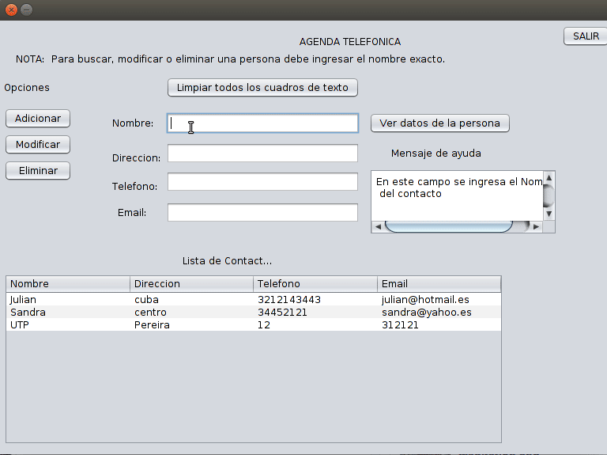

# Agenda Java Swing Implementation

This implementation use a Java Swing interface to manage contacts.

## Usage with console

```
cd AgendaSrc
javac Watch.java
java Watch
```

## Usage with Netbeans

Just open `AgendaNetbeans` project with Netbeans IDE.

## Preview

